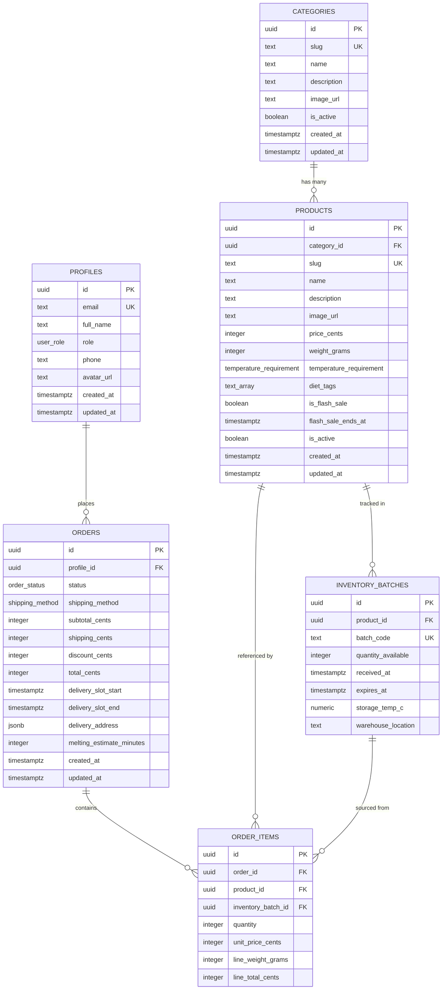

# FrozenFresh – Entity Relationship Diagram

## Key Relationships

| From            | To                | Type     | Notes                                    |
| --------------- | ----------------- | -------- | ---------------------------------------- |
| categories      | products          | 1 : N    | A category has many products             |
| products        | inventory_batches | 1 : N    | Each product can have multiple batches   |
| profiles        | orders            | 1 : N    | A profile can place many orders          |
| orders          | order_items       | 1 : N    | An order contains many line items        |
| products        | order_items       | 1 : N    | A product appears in many order items    |
| inventory_batch | order_items       | 1 : N    | Nullable FK for batch-level traceability |

## Notable Design Decisions

- **Cents-based pricing**: All monetary values stored as integers (cents) to avoid floating-point issues.
- **Weight in grams**: Internal unit is grams; converted to lb/oz on the frontend for US market.
- **JSONB delivery address**: Flexible schema for address data, avoids extra join table.
- **Soft-delete via `is_active`**: Products and categories use `is_active` flag instead of hard delete.
- **Array-based diet tags**: PostgreSQL `text[]` for multi-label tagging without a join table.
